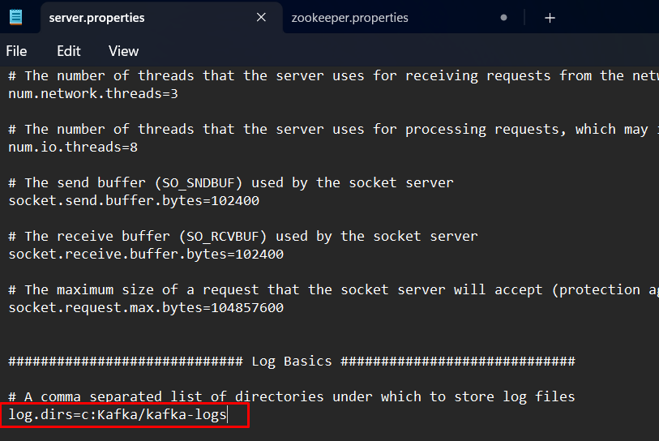
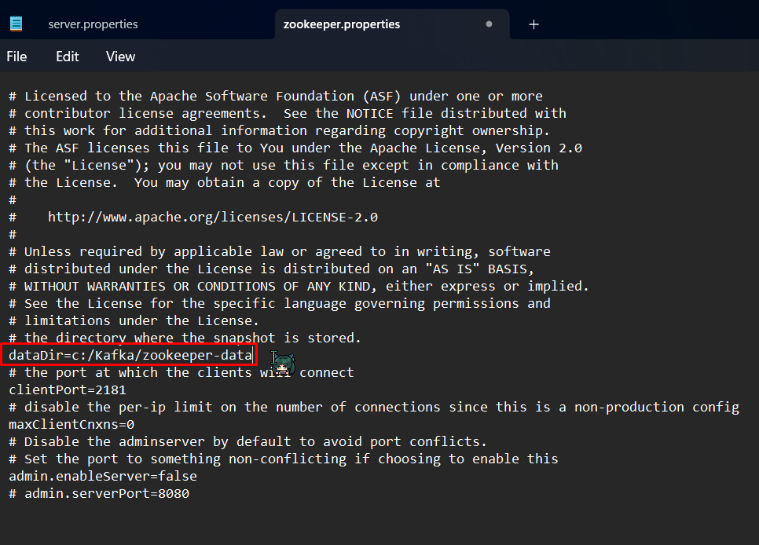
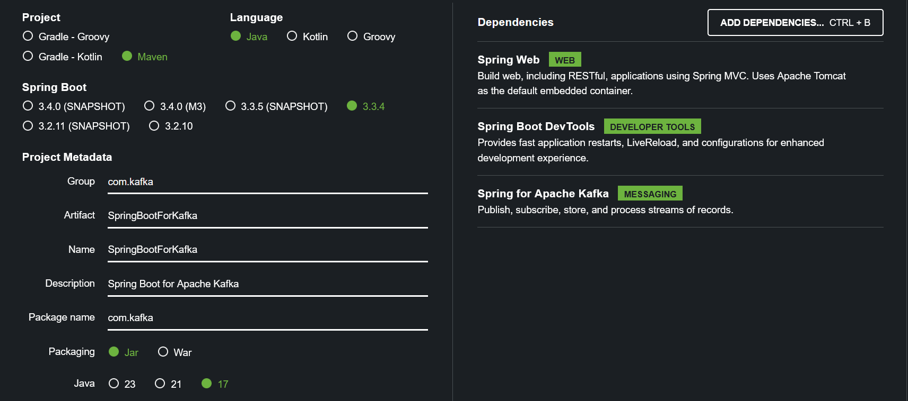

# kafka-practice
## Practice for Apache Kafka in microservices

### ✅  En este proyecto hare una practica con apache kafka en la terminal y luego sera pasado a un sistema de microservicios con SpringBoot
Tecnologias usadas

- [Apache Kafka](https://kafka.apache.org/documentation/)
- [SpringBoot](https://spring.io/projects/spring-boot)

### 🔶Comandos para iniciar Zookeeper y Kafka en la Terminal

#### ▶️ Configurar kafka para guardar logs en windows se debe editar server.properties y zookeper.properties en el directorio config

  

## ⚠️Todos los comandos a continuacion se usan en la terminal de windows
#### ▶️ Iniciar Zookeeper

Zookeeper es un recurso que utiliza kafka para funcionar correctamente

    .\bin\windows\zookeeper-server-start.bat .\config\zookeeper.properties

#### ▶️ Iniciar Kafka

    .\bin\windows\kafka-server-start.bat .\config\server.properties

#### ▶️ Crea un nuevo topic en el servidor de kafka

Topic es un tema de conversacion por el cual se van a enviar mensajes mediante kafka, sin esto no se pueden enviar
  
Las variables {topic-name} y {host} se deben cambiar dependiendo del caso de uso.

    .\bin\windows\kafka-topics.bat --create --topic {topic-name} --bootstrap-server {host}:9092

#### ▶️ Decribir los detalles de un topic

Con este comando podemos listar los detalles de un topic en especifico

    .\bin\windows\kafka-topics.bat --describe --topic {topic-name} --bootstrap-server {host}:9092

#### ▶️ Listar todos los topics que existen dentro del broker
Con este comando podemos listar todos los topics creados

    .\bin\windows\kafka-topics.bat --list --bootstrap-server {host}:9092

#### ▶️ Inicia una consola para ver mensajes de un topic específico

Aqui le indicamos a nuestra terminal especificamente a que topic observar

    .\bin\windows\kafka-console-consumer.bat --topic {nombreTopic} --bootstrap-server {host}:9092

#### ▶️ Inicia una consola para enviar mensajes a un topic específico

Aqui le indicamos a nuestra terminal especificamente a que topic enviara mensajes

    .\bin\windows\kafka-console-producer.bat --broker-list {host}:9092 --topic {topic-name}

# Inicializar proyecto con Spring Boot 🍃

#### ▶️ [Utilizando Spring initializr  ](https://start.spring.io/)

El proyecto estara basado en **Sprinboot 3** con **Java 17**

Las dependencias utilizadas en este proyecto seran
- Spring Web
- Spring Boot DevTools
- Spring for Apache Kafka  

  
